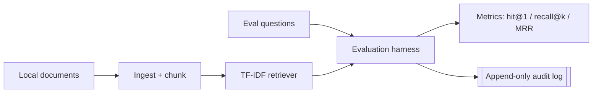

# Local AI RAG Lab

A **local-first, privacy-preserving starter** for evaluating retrieval quality
over your business documents — before you commit to a heavier RAG stack. The
core runs entirely on the Python standard library: **no API keys, no network
calls, no data leaving your machine.**

> **Disclaimer & privacy**
> Ships with **fictional sample documents only** — no real customer, legal, or
> proprietary content. The `.env.example` contains placeholders only. This lab is
> designed so sensitive documents can be evaluated **entirely offline**.

## Problem

RAG demos are easy; knowing whether retrieval actually finds the right content is
hard. Teams reach for hosted embedding APIs on day one — sending internal
documents to third parties — without a baseline to measure against. This lab
gives you a transparent, offline retrieval baseline and a simple evaluation
harness so you can measure first and add complexity deliberately.

## Scope

- **Ingestion** — load local Markdown documents and split them into overlapping
  chunks.
- **Retrieval** — a dependency-free TF-IDF + cosine-similarity retriever.
- **Evaluation** — score a labelled question set with `hit@1`, `recall@k`, and
  `MRR`.
- **Audit** — append-only JSONL log of every query (with an option to store only
  a hash of the query text for privacy).

Out of scope: a hosted vector database or any cloud LLM. The README shows where
to plug in a **local** embedding backend if you want to go further.

## Architecture



## Quick start

Requires **Python 3.9+**. No third-party packages are needed for the core lab.

```bash
# Optional but recommended: install as an editable package to get CLI entry points
pip install -e .

# 1. Ingest the sample documents into chunks
python -m rag_lab.ingest          # or: rag-ingest

# 2. Run the retrieval evaluation
python -m rag_lab.evaluate        # or: rag-evaluate
```

Without installing, run from the repo root with `PYTHONPATH=src`:

```bash
PYTHONPATH=src python -m rag_lab.evaluate
```

Example output:

```
Aggregate metrics:
  questions: 6
  hit@1: 1.0
  recall@3: 1.0
  mrr: 1.0
```

## Configuration

Copy `.env.example` to `.env` to tune behaviour (all optional):

| Variable              | Default | Purpose                                              |
|-----------------------|---------|------------------------------------------------------|
| `RAG_CHUNK_SIZE`      | `80`    | Words per chunk                                      |
| `RAG_CHUNK_OVERLAP`   | `20`    | Overlap between chunks                               |
| `RAG_TOP_K`           | `3`     | Results retrieved per query                          |
| `RAG_LOG_QUERY_TEXT`  | `true`  | `false` = store only a SHA-256 hash of the query     |

## Folder structure

```
local-ai-rag-lab/
├── README.md
├── LICENSE
├── pyproject.toml
├── requirements.txt
├── .env.example
├── .gitignore
├── data/sample_docs/          # fictional business documents
├── eval/questions.json        # labelled evaluation set
├── src/rag_lab/
│   ├── config.py              # config + tiny .env loader
│   ├── ingest.py              # load & chunk documents
│   ├── retriever.py           # TF-IDF cosine retriever
│   ├── evaluate.py            # hit@1 / recall@k / MRR harness
│   └── audit.py               # append-only query audit log
└── tests/test_retrieval.py
```

## Extending to local embedding models

The TF-IDF retriever is your baseline. To try dense retrieval **without leaving
your machine**, install the optional extra and swap the retriever:

```bash
pip install -e .[embeddings]     # sentence-transformers + numpy, run locally
```

Or point the lab at a local embedding server (e.g. [Ollama](https://ollama.com))
via the placeholders in `.env.example`. The evaluation harness and audit log are
retriever-agnostic, so you can compare a local embedding model against the
baseline using the same metrics.

## Limitations

- The TF-IDF baseline is lexical: it matches words, not meaning. That is the
  point — it is the honest baseline to beat.
- The sample evaluation set is tiny and hand-labelled; replace it with your own
  questions and relevance labels for a meaningful measurement.
- No answer-generation step is included; this lab measures **retrieval**, which
  is where most RAG quality is won or lost.

## Roadmap

- [ ] Pluggable retriever interface with a local embedding implementation
- [ ] Additional metrics (nDCG, precision@k)
- [ ] Optional local re-ranking step

## License

Released under the [MIT License](LICENSE).
