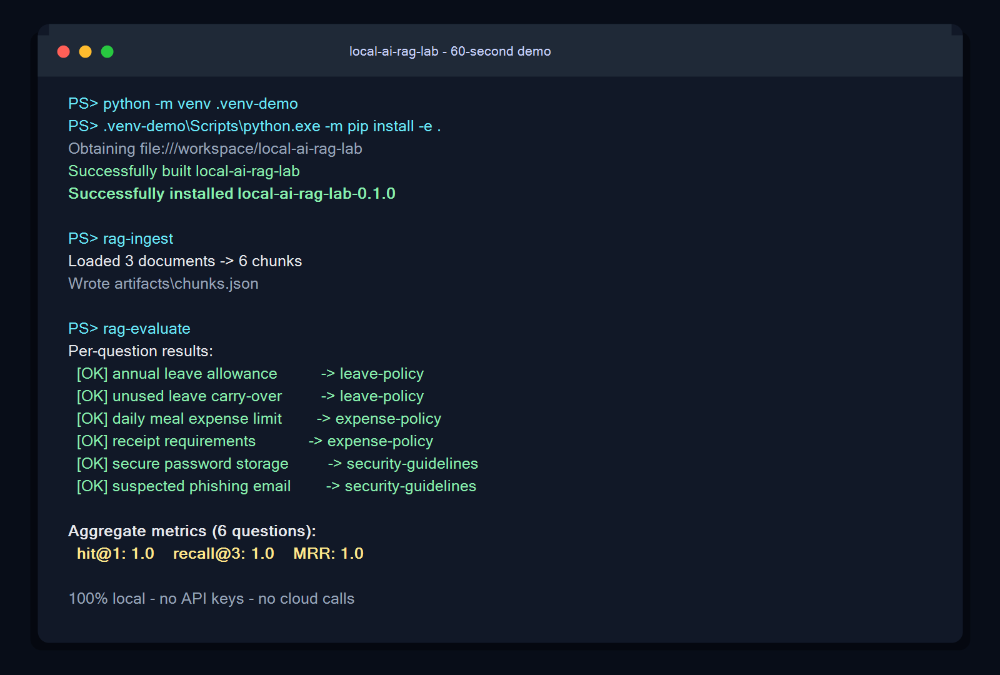

# 🔎 local-ai-rag-lab

**A local-first, privacy-preserving starter for evaluating retrieval quality over your business documents — before you commit to a heavier RAG stack.**


[](https://github.com/ramiabukhader/local-ai-rag-lab/actions/workflows/ci.yml)


Retrieval is where most RAG quality is won or lost. This lab lets you measure it — **hit@1, recall@k, MRR** — on your own documents, fully offline, with **zero API keys and zero cloud calls**.

## 60-second demo



Run the same workflow yourself:

```bash
git clone https://github.com/ramiabukhader/local-ai-rag-lab.git
cd local-ai-rag-lab
./demo.sh
```

On Windows PowerShell:

```powershell
git clone https://github.com/ramiabukhader/local-ai-rag-lab.git
cd local-ai-rag-lab
powershell -ExecutionPolicy Bypass -File .\demo.ps1
```

---

## Why this exists

Before wiring up a vector DB, an embedding API, and an LLM, you should know one thing: **can your retriever even find the right chunk?** This lab gives you that answer in a minute, on your data, without sending a single byte off your machine.

- 🔒 **Private by default** — no external services; audit logs hash queries unless raw text is explicitly enabled.
- ⚡ **Zero-setup baseline** — no GPU, no API keys, runs on a laptop.
- 📊 **Real metrics** — hit@1, recall@k, MRR against a labeled question set.
- 🔁 **Reproducible ranking** — equal scores use stable document/chunk ID ordering.
- 🧩 **Swap-in ready** — drop in dense embeddings (`sentence-transformers`) when you want to compare.

## Quickstart

```bash
git clone https://github.com/ramiabukhader/local-ai-rag-lab
cd local-ai-rag-lab
python -m venv .venv
source .venv/bin/activate
python -m pip install -e .

cp .env.example .env          # optional — sensible defaults work out of the box
rag-ingest                    # load & chunk data/sample_docs/
rag-evaluate                  # score eval/questions.json
# → hit@1: 1.0  recall@3: 1.0  mrr: 1.0
```

The core package uses only the Python standard library and runs on Python 3.9 through 3.14.

## Use your own documents

1. Drop your files in `data/sample_docs/`.
2. Add labeled questions to `eval/questions.json` (`question` → expected source doc).
3. Tune chunking in `.env`, then re-run `rag-ingest` followed by `rag-evaluate`.

Each evaluation record has a stable unique ID, a nonempty question, and one or
more document IDs matching Markdown filenames (without `.md`):

```json
{
  "id": "leave-entitlement",
  "question": "How much annual leave is available?",
  "relevant_docs": ["leave-policy"]
}
```

The evaluator rejects malformed JSON, duplicate IDs, empty fields, and unknown
document references before retrieval or audit logging begins.

## Configuration

| Variable | Default | Purpose |
|----------|---------|---------|
| `RAG_CHUNK_SIZE` | 80 | Words per chunk |
| `RAG_CHUNK_OVERLAP` | 20 | Overlap between chunks |
| `RAG_TOP_K` | 3 | Results returned per query |
| `RAG_LOG_QUERY_TEXT` | false | Set `true` only to opt into raw query text in audit logs |

`RAG_TOP_K` must be a positive integer. Equal-score results are ordered by
document ID and then chunk ID, so changing ingestion input order does not change
which chunks cross the top-k boundary.

Audit entries always contain a deterministic SHA-256 query hash and retrieved
document/chunk IDs with scores. By default they omit the raw query, and they
never contain retrieved chunk text. Boolean environment values must be one of
`true/false`, `1/0`, `yes/no`, or `on/off`; invalid values fail explicitly.

## What the metrics mean

- **hit@1 / precision@1** — was the correct document the top result?
- **recall@k** — was it anywhere in the top *k*?
- **MRR** — average of 1/rank of the correct result (higher = it ranks nearer the top).

### Baseline results by chunking strategy

These results use the six labeled questions and three fictional documents committed in this repository. Re-run `rag-evaluate` on your own corpus before choosing a production configuration.

| Chunk size | Overlap | Precision@1 (hit@1) | Recall@3 | MRR |
|-----------:|--------:|---------------------:|---------:|----:|
| 40 words | 10 words | 1.000 | 1.000 | 1.000 |
| 80 words (default) | 20 words | 1.000 | 1.000 | 1.000 |
| 120 words | 30 words | 1.000 | 1.000 | 1.000 |

The sample corpus is intentionally small, so the identical scores are a smoke-test baseline rather than evidence that chunk size never matters. Larger, varied corpora should expose the precision/recall trade-off more clearly.

## Project layout

```
src/rag_lab/
  config.py     # .env loader + defaults
  ingest.py     # document loading & chunking
  retriever.py  # TF-IDF + cosine-similarity retrieval
  evaluate.py   # evaluation harness (hit@1 / recall@k / MRR)
  audit.py      # append-only query audit log
data/sample_docs/   # fictional sample documents
eval/questions.json # labeled evaluation set
tests/              # pytest suite
```

## Roadmap

See [open issues](https://github.com/ramiabukhader/local-ai-rag-lab/issues) for planned chunk-size benchmarks and a dense-embedding comparison.

## License

MIT © Rami Abukhader
